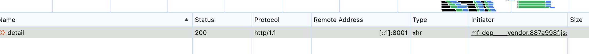

<!--
 * @Author: error: error: git config user.name & please set dead value or install git && error: git config user.email & please set dead value or install git & please set dead value or install git
 * @Date: 2025-12-29 10:55:15
 * @LastEditors: error: error: git config user.name & please set dead value or install git && error: git config user.email & please set dead value or install git & please set dead value or install git
 * @LastEditTime: 2025-12-29 15:36:00
 * @FilePath: /cjmLearn/chrome/http1,2,3的区别.md
 * @Description: 这是默认设置,请设置`customMade`, 打开koroFileHeader查看配置 进行设置: https://github.com/OBKoro1/koro1FileHeader/wiki/%E9%85%8D%E7%BD%AE
-->

# http1.0

# http1.1

## 特点

- **基于文本的协议**
- **持久连接**：连接默认保持活跃，多个请求可以复用同一个 TCP 连接。这意味着客户端可以在同一个连接上发起多个请求和接收多个响应，直到客户端或服务器明确关闭连接。
- **管道化**：HTTP/1.1 引入了管道化（pipelining）的概念，允许客户端在同一个连接上同时发送多个请求，而无需等待前一个请求的响应。这样可以减少延迟，提高性能。但是服务器仍然按照顺序处理请求。
- **分块传输编码**：HTTP/1.1 引入了分块传输编码（chunked transfer encoding），允许服务器将响应数据分成多个块进行发送，而不是一次性发送整个响应。这对于处理大文件或动态生成的内容非常有用。
- **带宽优化**：支持更好的带宽利用，如 Cache-Control、Host、Transfer-Encoding 等头部字段的支持。

## 缺点

- chrome 限制了同一个域名下的请求数量，超过「 6 」个会被阻塞
- 虽然有持久连接，但对于有很多并发请求的页面，仍然可能会打开多个 TCP 连接，增加了连接管理的复杂性。
- **队头阻塞**：即使开启了管道化，HTTP/1.1 中服务器会按顺序返回响应，所以如果前面的请求很慢，会导致后面的请求都处于等待状态，导致“队头阻塞”。

# http2

## 特点

- **基于二进制的协议**
- **多路复用**：在一个 TCP 连接中可以并发发送多个请求和响应，而不需要等待一个请求完成才能发下一个请求，解决了 HTTP/1.1 中的队头阻塞问题。
- **头部压缩**：HTTP/2 对头部进行了压缩，减少了重复传输相同头部信息的开销。

## 限制

- 同一个域名下的请求数量没有限制
- 必须要是 https 协议
- 虽然 HTTP/2 向下兼容 HTTP/1.x，但旧的代理、负载均衡器等中间件可能不完全支持 HTTP/2
  HTTP/2 在协议语义上是兼容 HTTP/1.x 的，但它使用的是完全不同的二进制帧格式。很多老的代理、负载均衡或安全设备只能解析 HTTP/1.x 的文本协议，无法理解 HTTP/2 的多路复用、头部压缩和流控制机制，因此可能会导致连接失败、功能失效，或者在中间节点直接降级为 HTTP/1.1。

      - 所以在实际生产中，HTTP/2 往往只部署在客户端到第一层网关，中间服务仍然使用 HTTP/1.1。

```jsx
浏览器 (HTTP/2)
   ↓
Nginx（支持 HTTP/2）
   ↓  ❌ 降级
内部服务（HTTP/1.1）
```

# http1 和 http2 的区别

## 请求方法层面

HTTP/1.x 和 HTTP/2 在请求方法层面是完全一致的，GET、POST、PUT、DELETE 等方法的语义没有任何变化。
HTTP/2 的变化主要体现在传输层：请求方法不再以文本请求行的形式存在，而是作为 :method 伪头字段参与二进制帧传输，并且可以被头部压缩和多路复用，从而提升并发性能，但并不改变方法本身的语义。

## 协议

HTTP/1.x 是基于文本的协议，HTTP/2 是基于二进制的协议。

## 请求和响应

在 HTTP/1.x 中，每个请求/响应都需要建立新的连接，而 HTTP/2 通过多路复用允许多个请求/响应共享同一个连接。

## 头部压缩

HTTP/2 对请求和响应头部进行压缩，而 HTTP/1.x 的头部是以明文形式传输的，浪费带宽。

## 服务器推送

HTTP/2 支持服务器推送功能，可以提前发送客户端可能需要的资源，而 HTTP/1.x 只在客户端请求时才发送响应。

# http2 是你想用就能用的？

不是，不是说前端想用就能用，而是要配合服务端，网关什么的。

# 怎么验证你现在用的是 http1 还是 http2

- Chrome DevTools（最常用）打开 Network 右键表头勾选 Protocol，可以看到你当前的请求是 http1 还是 http2
  

# 附件- http3

运行在 QUIC 协议之上的 HTTP 协议，使用 UDP 代替 TCP，彻底解决了 TCP 层队头阻塞问题。

## 为什么要有 http3

- 解决了 TCP 层队头阻塞问题

## 核心

- QUIC 协议
- QUIC 是 Google 提出、IETF 标准化的一种 基于 UDP 的可靠传输协议

## 优点

- 真正消除队头阻塞
- 首包延迟极低
- 网络切换不断连
- 非常适合移动端
- 高丢包环境表现好

## 缺点

- UDP 可能被防火墙封
- 实现复杂，调试困难
- CPU 消耗更高
- 企业内网支持度较低
