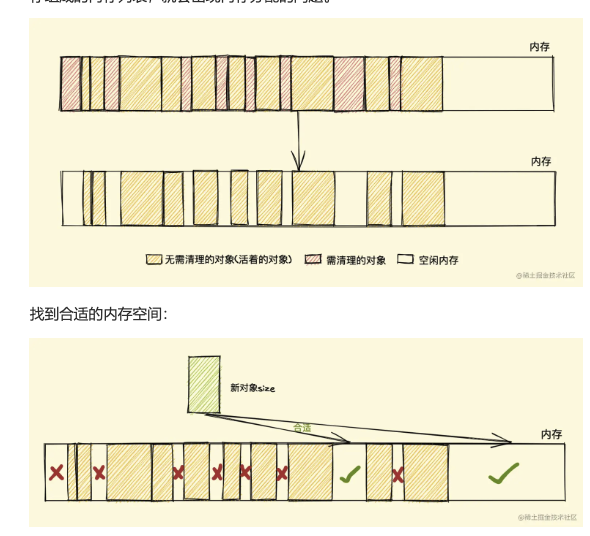
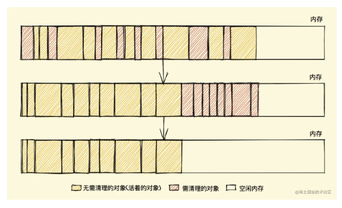
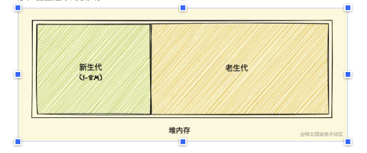
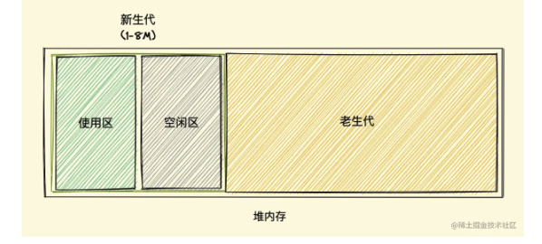
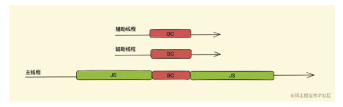

# 浏览器的垃圾回收机制

## 标记清除法（会导致内存碎片化）

- 标记阶段：为所有活动对象新增标记
- 清除阶段：把没有标记的对象清除
  需要从出发点去遍历内存中所有的对象去打标记，出发点有很多，我们称为一组根对象，所谓的根对象，再浏览器中包括又不止于全局 windows 对象，文档 dom 树等。

### 优缺点

- 优点：实现比较简单，一位二进制位（0/1)就可以为其标记，十分简单。
- 缺点：由于在清除无用的对象后，剩余的内存位置不会发生变化，会导致剩余的内存空间是不连续的，出现了**内存碎片**,由于剩余的空间不是一整块，是由大小不同的内存组成的内存列表，就会出现**内存分配**的问题。
  

### 内存分配的几种策略

- First-fit：找到大于等于 size 的块立即返回 复杂度：o(n) 最快的
- Best-fit：遍历整个空闲列表，返回大于等于 size 的最小分块
- Worst-fit：遍历整个空闲列表，找到最大的分块，然后切成两部分，一部分 size 大小，并将该部分返回

### 优化算法

**标记整理（Mark-Compact）算法。**
标记结束后，标记整理算法会将活着的对象（即不需要清理的对象）向内存的一端移动，最后清理掉边界的内存（如下图）


## 引用计数法

引用计数（Reference Counting），这其实是早先的一种垃圾回收算法，它把 对象是否不再需要 简化定义为 对象有没有其他对象引用到它，如果没有引用指向该对象（零引用），对象将被垃圾回收机制回收。

它的策略是跟踪记录每个变量值被使用的次数

- 当声明了一个变量并且将一个引用类型赋值给该变量的时候这个值的引用次数就为 1
- 如果同一个值又被赋给另一个变量，那么引用数加 1
- 如果该变量的值被其他的值覆盖了，则引用次数减 1
- 当这个值的引用次数变为 0 的时候，说明没有变量在使用，这个值没法被访问了，回收空间，垃圾回收器会在运行的时候清理掉引用次数为 0 的值占用的内存

### 缺点

- 循环引用，导致内存泄漏。

# v8 垃圾回收机制

## 分代式垃圾回收机制

新老生代：分代式垃圾回收机制，将堆内存分为新生代和老生代两个区域，采用不 同的垃圾回收器也就是不同的策略管理立即回收。

- 新生代： 新产生的对象，存活时间较短的对象。
- 老生代：存活时间较长或者常驻内存的对象。经过新生代垃圾回收之后还存在的对象，容量通常比较大。
  

  ## 新生代垃圾回收算法：

  新生代对象是通过一个名为 Scavenge 的算法进行垃圾回收，在 Scavenge 算法 的具体实现中，主要采用了一种复制式的方法即 Cheney 算法。将堆内存一分为 2，一个是使用区，一个是空闲区。
  

  ### 复制式垃圾回收算法的具体实现：

      具体过程：
      - 1.新加入的对象都会进入到使用区。
      - 2.当使用区快被写满时，就需要进行一遍垃圾清理操作。
      - 3.垃圾回收器对使用区中的活动对象做标记。
      - 4.将使用区中的活动对象复制进入空闲区然后进行排序。
      - 5.然后将使用区中的非活动对象进行清理。
      - 6.角色互换，空闲区变使用区，使用区变空闲区。

  ### 新生代变成老生代的条件：

  当一个对象经过多次复制后依然存活，它将会被认为是生命周期较长的对象，随后会被移动到老生代中，采用老生代的垃圾回收策略进行管理
  如果复制一个对象到空闲区，空闲区的空间占用超过了 25%，就会直接被晋升到老生代中。

  ## 老生代垃圾回收算法

  由于老生代中的对象通常比较大。如果像新生代算法一样复制，效率会低下。所以老生代垃圾回收使用**标记清除算法**。

  为防止内存碎片化，老生代垃圾回收采用**标记整理算法**。

## 并行垃圾回收

我们先要了解一个概念 全停顿（Stop-The-World），我们都知道 JavaScript 是一门单线程的语言，它是运行在主线程上的，那在进行垃圾回收时就会阻塞 JavaScript 脚本的执行，需等待垃圾回收完毕后再恢复脚本执行，我们把这种行为叫做 全停顿

开启多个辅助线程，同时执行回收工作。这样做虽然能把之前的假如 3s 的垃圾回收时间降低到比如 1s，但是这 1s，主线程也是要让出来执行垃圾回收机制。


## 增量标记和懒性清理

## 怎么样才能让一个变量被垃圾回收掉？

- 1. 解除引用

```jsx
// 解除引用
let arr = [{ a: 1 }, { b: 2 }];
arr[0] = null; // 删除数组元素的引用
arr = []; // 或者直接将数组重新赋值为空数组
```

- 2. 局部变量作用域结束
- 3. 全局变量作用域结束
- 4. 及时清除不必要的闭包
- 5. 使用 WeakMap 和 WeakSet
- WeakMap 和 WeakSet 是特殊的集合类型，它们的键（WeakMap）或值（WeakSet）不会被计入垃圾回收的引用计数。如果一个对象在 WeakMap 或 WeakSet 中不再被引用，它会被自动垃圾回收。

```jsx
let obj = { a: 1 };
let weakMap = new WeakMap();

weakMap.set(obj, "value");
obj = null; // obj 不再被引用

// 由于 obj 是 WeakMap 的键，它会被垃圾回收
```
