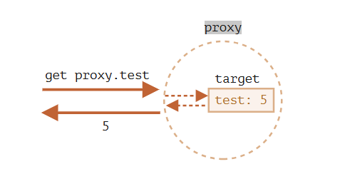

# proxy 代理

https://zh.javascript.info/proxy

## 作用

Proxy 对象用于创建一个对象的代理，从而实现基本操作的拦截和自定义（如属性查找、赋值、枚举、函数调用等）。

## 语法

```js
const p = new Proxy(target, handler);
```

## 详细介绍

-target 要使用 Proxy 包装的目标对象。----**可以是任何类型的对象，包括原生数组，函数，甚至另一个代理**  
-handler 带有“捕捉器”（“traps”，即拦截操作的方法）的对象**说人话：一个对象，它的属性是函数**，各属性中的函数分别定义了在执行各种操作时代理 p 的行为。  
捕捉器的意思：比如 get 捕捉器用于读取 target 的属性，set 捕捉器用于写入 target 的属性，等等。

### 没有捕捉器的 proxy 是一个 target 的透明包装器

```js
let target = {};
let proxy = new Proxy(target, {}); // 空的 handler 对象

proxy.test = 5; // 写入 proxy 对象 (1)
alert(target.test); // 5，test 属性出现在了 target 中！

alert(proxy.test); // 5，我们也可以从 proxy 对象读取它 (2)

for (let key in proxy) alert(key); // test，迭代也正常工作 (3)
```

我们可以看到，没有任何捕捉器，proxy 是一个 target 的透明包装器（wrapper）。  


所有对 proxy 的操作都直接转发给了 target。

### 设置捕捉器的 proxy 可以拦截操作

**注意**

代理应该在所有地方都**完全替代目标对象**。目标对象被代理后，任何人都不应该再引用目标对象。否则很容易搞砸。

**代理覆盖变量**

\*_dictionary = new Proxy(dictionary, ...);_

**一些捕捉器：**


### get 捕捉器

\*_get(target, property, receiver)_

- target：目标对象（被代理的对象）
- property：目标属性名
- receiver：如果目标属性是一个 getter 访问器属性，则 receiver 就是本次读取属性所在的 this 对象。通常，这就是 proxy 对象本身（或者，如果我们从 proxy 继承，则是从该 proxy 继承的对象

```js
let obj = {
  name: "cjm",
};
let p = new Proxy(obj, {
  get(target, key) {
    console.log("取数了!");
    return target[key];
  },
});
let name = p.name;
```

### set 捕捉器

\*_set(target, property, value, receiver)_

- target：目标对象（被代理的对象）
- property：目标属性名
- value：目标属性值
- receiver：如果目标属性是一个 setter 访问器属性，则 receiver 就是本次写入属性所在的 this 对象。通常，这就是 proxy 对象本身（或者，如果我们从 proxy 继承，则是从该 proxy 继承的对象）

```js
let obj = {};
obj = new Proxy(obj, {
  set(target, key, value) {
    if (typeof value === "string" && typeof key === "string") {
      target[key] = value;
      console.log(true);
    } else {
      console.log(false);
    }
  },
});
obj.name = "cjm";
obj.age = 18;
console.log(obj); // {name: 'cjm'}
```

### apply 捕捉器

**捕捉器能使代理以函数的方式被调用** \*_apply(target, thisArg, args)_

- target：目标对象（在 JavaScript 中，函数就是一个对象）
- thisArg：目标函数的 this 值
- args：目标函数的参数列表

```js
function greet(name) {
  return "Hello " + name;
}
greet = new Proxy(greet, {
  apply: function (target, thisArg, argumentsList) {
    console.log("函数被调用了");
    return target.apply(thisArg, argumentsList);
  },
});
greet("cjm");
```

##### apply 捕捉器的应用场景

-1.日志记录：你可以记录函数的调用信息，比如函数名、参数等。

-2.参数验证：可以在调用函数前检查和修改传入的参数。

-3.函数缓存 ：可以根据传入的参数返回缓存的结果，从而提高性能。

### has 捕捉器

**has 捕捉器会拦截 in 调用** \*_has(target, property)_

- target：目标对象
- property：目标属性名
  **in 运算符**
  in 操作符会检查对象本身是否包含指定的属性，也会检查该属性是否继承自该对象的原型链。

**in 和 hasOwnProperty 的区别**

- in 操作符会检查对象本身以及原型链上的属性。

- hasOwnProperty 只会检查对象本身的属性，不会检查原型链。

```js
// 目标对象
const obj = { name: "Alice", age: 25 };

// 创建代理对象
const handler = {
  has: function (target, prop) {
    if (prop === "age") {
      console.log(`访问属性 ${prop}`);
    }
    return prop in target; // 返回属性是否存在
  },
};

// 创建 Proxy
const proxyObj = new Proxy(obj, handler);

// 使用 'in' 操作符触发 has 捕捉器
console.log("name" in proxyObj); // 输出: true
console.log("age" in proxyObj); // 输出: 访问属性 age \n true
console.log("address" in proxyObj); // 输出: false
```

##### has 捕捉器的应用场景

虚拟属性的实现：可以通过 has 捕捉器来模拟某些虚拟属性的存在，实际并没有这些属性，但你可以根据需求动态计算它们。

权限控制：在访问属性时，你可以基于某些逻辑控制哪些属性可以被访问，哪些属性应该被拒绝访问。

日志和监控：可以记录对属性的访问，进行调试或监控。

#### construct 捕捉器

### 一些具体的示例

### 扩展构造函数

```js
//base是boy的构造函数
//sup是父类(模拟父类)
function extend(sup, base) {
  var descriptor = Object.getOwnPropertyDescriptor(
    base.prototype,
    "constructor"
  ); //获取base.prototype的constructor属性描述符

  //base 继承 sup
  base.prototype = Object.create(sup.prototype);
  //捕捉器
  var handler = {
    //拦截new操作符
    construct: function (target, args) {
      var obj = Object.create(base.prototype); //创建了一个base的实例对象
      this.apply(target, obj, args); //会调用apply捕捉器
      return obj;
    },
    //拦截普通函数调用
    /*{
    target: 被代理的构造函数， 在这里是 Boy。

    that: 当前对象，也就是实例化后的 Boy 实例。

    args: 构造函数调用时传递的参数。
    作用：确保在创建 Boy 类的实例时，父类的构造函数（Person）和子类的构造函数（Boy）都会被调用。这样，Boy 类的实例既会获得 Person 类的 name 属性，也会拥有 Boy 类的 age 属性。
    }*/
    apply: function (target, that, args) {
      sup.apply(that, args); //调用父类的构造函数
      base.apply(that, args); //调用子类的构造函数
    },
  };
  var proxy = new Proxy(base, handler);
  descriptor.value = proxy;
  Object.defineProperty(base.prototype, "constructor", descriptor);
  return proxy;
}

var Person = function (name) {
  this.name = name;
};

var Boy = extend(Person, function (name, age) {
  this.age = age;
});

Boy.prototype.sex = "M";

var Peter = new Boy("Peter", 13);
console.log(Peter.sex); // "M"
console.log(Peter.name); // "Peter"
console.log(Peter.age); // 13
```

### 操作 dom 节点
