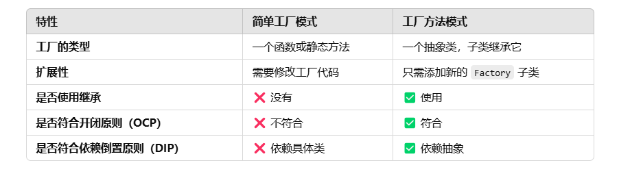

# 设计模式（简单工厂模式/工厂设计模式/抽象工厂模式）创建型

## 开闭原则（OCP）

\*_对扩展开放，对修改封闭_

## 简单工厂模式

### 定义

简单工厂模式（Simple Factory Pattern）是一种创建型设计模式，它提供了一种创建对象的最佳方式。在简单工厂模式中，我们创建一个工厂类，该类负责根据客户端的请求创建不同类型的对象。 \*_首先是几种不同的产品_

### 特点

### 具体实现

```ts
//产品的接口
interface ClockInterface {
  tick(): void;
}
//钟表产品类
class WatchClock implements ClockInterface {
  tick(): void {
    console.log("手表 dida dida");
  }
  specialMethod(): void {
    console.log("手表特殊方法");
  }
}
//数字钟
class DigitalClock implements ClockInterface {
  tick(): void {
    console.log("数字钟 beng beng");
  }
  specialMethod(): void {
    console.log("数字钟特殊方法");
  }
}
```

\*_然后通过创建一个简单工厂类，然后调用_

```ts
//简单工厂类
class ClockFactory {
  createClock(type: string): ClockInterface {
    switch (type) {
      case "digital":
        return new DigitalClock();
      case "watch":
        return new WatchClock();
      default:
        throw new Error("type error");
    }
  }
}
//客户端
console.log("------------------");
let factory = new ClockFactory();
let digitalClock = factory.createClock("digital");
let watchClock = factory.createClock("watch");
digitalClock.tick();
watchClock.tick();
```

**我们可以看到这么写，你需要维护一个 if else 语句或者一个 switch 语句，当你增加一个产品类的时候，你需要修改这个工厂类，这是不符合开闭原则的**  
🔴**当然我们还可以进一步优化一下：**

```ts
//构造函数签名 接口
interface ClockConstructor {
  new (): ClockInterface;
}
//简单工厂类
class ClockFactory {
  createClock(ctor: ClockConstructor): ClockInterface {
    return new ctor();
  }
}
//客户端
console.log("------------------");
let factory = new ClockFactory();
let digitalClock = factory.createClock(DigitalClock);
let watchClock = factory.createClock(WatchClock);
digitalClock.tick();
watchClock.tick();
```

\*_这样我们就可以通过传入一个构造函数来创建一个对象，这样就符合开闭原则了。但是它仍然是简单工厂模式_

## 工厂方法模式

### 定义

定义一个用于创建对象的接口，让子类决定实例化哪一个类。Factory Method 使一个类的实例化延迟到其子类。
工厂方法模式的核心：创建逻辑交给子类实现，客户端只需依赖抽象类（接口），而不是具体类。

### 好处

1. 符合开闭原则。
2. 解耦创建和使用。客户端代码只依赖基类，不直接依赖具体类。
3. 提高代码复用性。

### 用处

1. 当一个类不知道它所必须创建的对象的类的时候。
2. 当一个类希望由它的子类来指定它所创建的对象的时候。
3. 当类将创建对象的职责委托给多个帮助子类中的某一个，并且你希望将哪一个帮助子类是代理者这一信息局部化的时候。

### 关键

1. 要有一个抽象工厂类，这个类中有一个抽象方法，这个方法返回一个抽象产品类。
2. 要有一个具体工厂类，这个类继承自抽象工厂类，用于实现抽象工厂。

### 一个实现模板

```js
//产品的接口
interface ClockInterface {
  tick(): void;
}
//钟表产品类
class WatchClock implements ClockInterface {
  tick(): void {
    console.log("手表 dida dida");
  }
  specialMethod(): void {
    console.log("手表特殊方法");
  }
}
//数字钟
class DigitalClock implements ClockInterface {
  tick(): void {
    console.log("数字钟 beng beng");
  }
  specialMethod(): void {
    console.log("数字钟特殊方法");
  }
}
interface ClockConstructor {
  new (): ClockInterface;
}

//抽象工厂类
abstract class ClockFactory {
  abstract createClock(): ClockInterface;
  public someOperation(): void {
    const product = this.createClock();
    product.tick();
  }
}
//手表工厂
class WatchFactory extends ClockFactory {
  createClock(): ClockInterface {
    return new WatchClock();
  }
}
//数字钟工厂
class DigitalFactory extends ClockFactory {
  createClock(): ClockInterface {
    return new DigitalClock();
  }
}

//客户端
function clientCode(creator: ClockFactory) {
  console.log("Client:我不知道创建者的类，但是它仍然在工作");
  creator.someOperation();
}
console.log("App: 启动");
clientCode(new WatchFactory());
console.log("");
console.log("App: 启动");
clientCode(new DigitalFactory());

```

### 一些具体使用情况

## 简单工厂模式和工厂方法模式的区别


