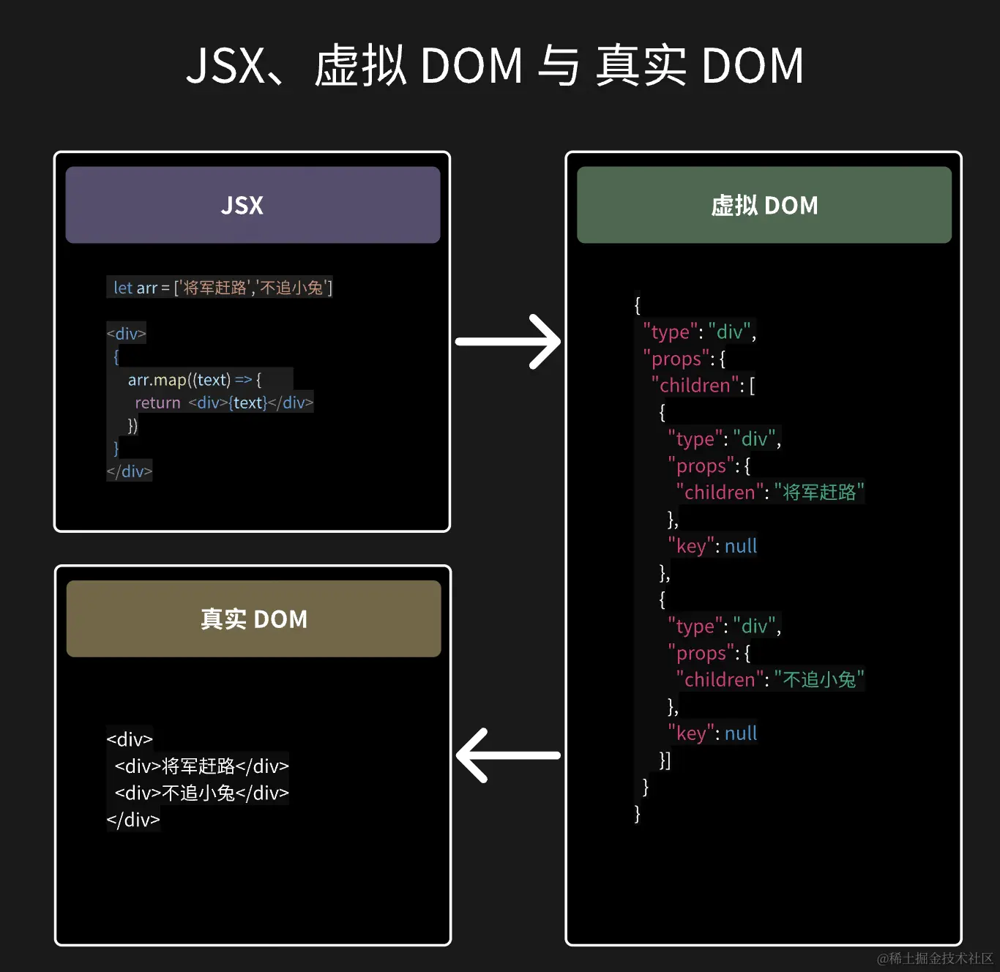

# 🚀fiber (important!) react16 引入的

- ## 先了解一下虚拟 DOM
- ### 什么是虚拟 DOM

  - 虚拟 DOM 是由 React.createElement()方法创建的一个 JavaScript 对象，它代表了真实 DOM 的一个抽象。
  - 它存在运行时内存里面(**随机存取存储器 RAM**)
    - ⭐RAM 是 CPU 用来快速读写数据的地方，和硬盘不太一样，内存的数据是临时的，断电或者刷新页面就会丢失。
  - 🏃‍♀️ 三个步骤：
    - 1️⃣ 生成虚拟 DOM 树。
    - 2️⃣ 对比两棵虚拟 DOM 树（新&旧）。
    - 3️⃣ 更新视图，patch 到真实 DOM。
  - 🕸 虚拟 dom 的结构
    

    - 1️⃣ typeof：一个 Symbol(react.element)（或数字常量，老版本），用于内部标识这是 React 元素，防止被当成普通对象
    - 2️⃣ type：元素的类型（如 div、span、p 等）。--重要之一
    - 3️⃣ props：元素的属性（如 className、style、onClick，children 等）。 --重要之一
    - 4️⃣ key：元素的唯一标识（用于优化性能）。
    - 5️⃣ ref：元素的引用（用于操作 DOM）。
    - 6️⃣ \_owner:

      ```jsx
      const element = <div className="container">Hello, world!</div>;
      ```

- ### diff 算法

  - react16 之前的 diff 算法是**递归**,深度优先策略。
  - 会存在两棵虚拟 dom 树，一个是当前的，一个是更新的。
  - diff 算法负责比较新旧虚拟 dom 树的差异，并计算出最小的更新操作集合来使新虚拟 dom 和真实的 dom 树保持同步。
    - ⚠️ 缺点
    - 同步进行，不可中断，导致主线程被长时间占用，会阻塞主线程，带来卡顿。
  - **👫 具体 diff 策略**
    - 1️⃣ 同层比较原则，仅对同层的元素进行比较，原因是要保证效率为 O(n)级别。
    - 比较过程中，会进行以下几种操作：
      - 相同类型复用：如果新旧节点的类型相同，那么会保留旧节点，只更新属性和子节点。
      - 不同类型替换：如果新旧节点的类型不同，那么会直接删除旧节点，创建新节点。
      - 移动节点：如果新旧节点的位置发生变化，那么会移动节点的位置。
        - 移动节点也只会在同层进行，不会跨层移动。
        - 关于 key 属性（很重要！可以提高性能）：
          - 如果没有设置 key 属性，那么 react 会认为所有的子节点都是唯一的，React 按顺序比对，错位就会导致大量删除和新建，性能差、状态丢失。。
          - 如果设置了 key 属性，那么 react 会根据 key 属性来识别'这是同一节点，只是顺序发生了变化'。
          - 那么在什么情况下需要加 key 呢？
            - 1️⃣ 列表渲染：如果列表项的顺序发生了变化，那么需要设置 key 属性来标识每个列表项。
            - 2️⃣ 表单元素：如果表单元素的顺序发生了变化，那么需要设置 key 属性来标识每个表单元素。
      - 文本节点：如果新旧节点都是文本节点，那么会直接更新文本内容。
    - 在比较的过程中也有一些原则
      - 先复用再增删
        
    - 2️⃣（跨级不复用）不同层的节点被认为是完全不同的，回直接删除旧节点，创建新节点。
      - 🌰**举个栗子**
        下图 C、E、F，只能删掉再重新创建。
        

- ### fiber
  - react16 之后为了提高 diff 算法的性能，引入了**fiber**。
  - **fiber 是个什么东西？**
  - ✨**优点**
    - 1️⃣ 异步可中断
