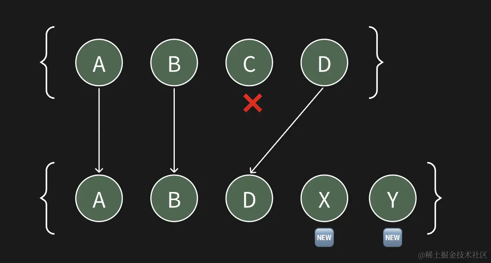
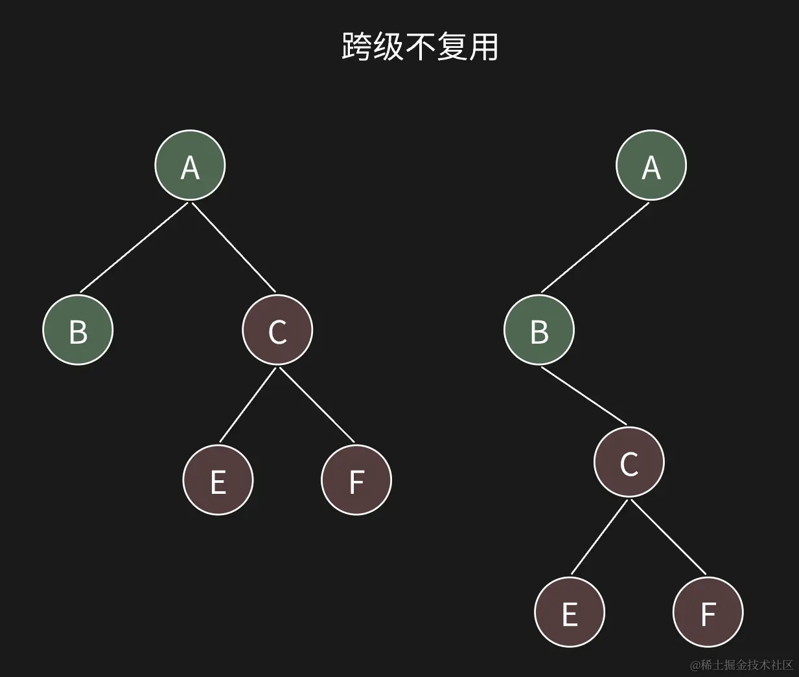

# 🚀fiber (important!) react16 引入的

- ## 先了解一下虚拟 DOM
- ### 什么是虚拟 DOM

  - 虚拟 DOM 是由 React.createElement()方法创建的一个 JavaScript 对象，它代表了真实 DOM 的一个抽象。
  - 它存在运行时内存里面(**随机存取存储器 RAM**)
    - ⭐RAM 是 CPU 用来快速读写数据的地方，和硬盘不太一样，内存的数据是临时的，断电或者刷新页面就会丢失。

- ### diff 算法

  - react16 之前的 diff 算法是**递归**。
  - 会存在两棵虚拟 dom 树，一个是当前的，一个是更新的。
  - diff 算法负责比较新旧虚拟 dom 树的差异，并计算出最小的更新操作集合来使新虚拟 dom 和真实的 dom 树保持同步。
    - ⚠️ 缺点
    - 同步进行，不可中断，会阻塞主线程。
  - **👫 具体 diff 策略**
    - 1️⃣ 同层比较原则，仅对同层的元素进行比较。
    - 比较过程中，会进行以下几种操作：
      - 相同类型复用：如果新旧节点的类型相同，那么会保留旧节点，只更新属性和子节点。
      - 不同类型替换：如果新旧节点的类型不同，那么会直接删除旧节点，创建新节点。
      - 移动节点：如果新旧节点的位置发生变化，那么会移动节点的位置。
      - 文本节点：如果新旧节点都是文本节点，那么会直接更新文本内容。
    - 在比较的过程中也有一些原则
      - 先复用再增删
        
    - 2️⃣（跨级不复用）不同层的节点被认为是完全不同的，回直接删除旧节点，创建新节点。
      - 🌰**举个栗子**
        下图 C、E、F，只能删掉再重新创建。
        

- ### fiber
  - react16 之后为了提高 diff 算法的性能，引入了**fiber**。
