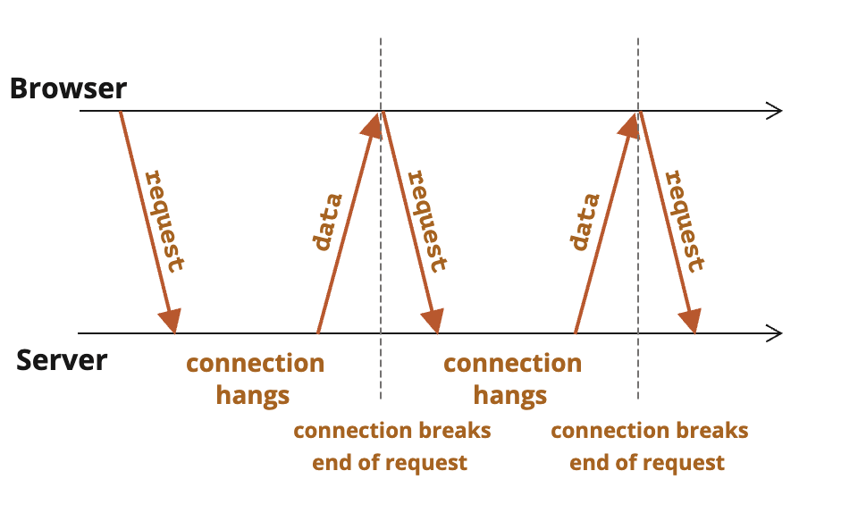

# 标准 http 轮询

HTTP 轮询由客户端（例如 Web 浏览器）组成，不断向服务器请求更新。

一个用例是想要关注快速发展的新闻报道的用户。在用户的浏览器中，他们已经加载了网页，并希望该网页随着新闻报道的展开而更新。实现这一点的一种方法是浏览器反复询问新闻服务器“内容是否有任何更新”，然后服务器将以更新作为响应，或者如果没有更新则给出空响应。浏览器请求更新的速率决定了新闻页面更新的频率——更新之间的时间过长意味着重要的更新被延迟。更新之间的时间太短意味着会有很多“无更新”响应，从而导致资源浪费和效率低下。

更新请求之间没有完美的时间间隔。请求总是要么太频繁（效率低下）要么太慢（更新时间比要求的要长）。
随着规模的扩大和客户端数量的增加，对服务器的请求数量也会增加。由于资源被无目的使用，这可能会变得低效和浪费。

---

从服务器获取新信息的最简单的方式是定期轮询。也就是说，定期向服务器发出请求：“你好，我在这儿，你有关于我的任何信息吗？”例如，每 10 秒一次。

作为响应，服务器首先通知自己，客户端处于在线状态，然后 —— 发送目前为止的消息包。

这可行，但是也有些缺点：

消息传递的延迟最多为 10 秒（两个请求之间）。  
即使没有消息，服务器也会每隔 10 秒被请求轰炸一次，即使用户切换到其他地方或者处于休眠状态，也是如此。就性能而言，这是一个很大的负担。  
因此，如果我们讨论的是一个非常小的服务，那么这种方式可能可行，但总的来说，它需要改进。

# 长轮询

所谓“长轮询”是轮询服务器的一种更好的方式。

它也很容易实现，并且可以无延迟地传递消息。

其流程为：

- 请求发送到服务器。
- 服务器在有消息之前不会关闭连接。
- 当消息出现时 —— 服务器将对其请求作出响应。
- 浏览器立即发出一个新的请求。

对于此方法，浏览器发出一个请求并与服务器之间建立起一个挂起的（pending）连接的情况是标准的。仅在有消息被传递时，才会重新建立连接。


```jsx
import axios from "axios";

function longPolling() {
  axios
    .get("/server-endpoint")
    .then((response) => {
      // 处理服务器返回的数据
      console.log("新数据:", response.data);

      // 数据处理完成后，重新发起请求
      longPolling();
    })
    .catch((error) => {
      console.error("请求出错:", error);
      // 如果请求失败，可以选择延迟后重试
      setTimeout(longPolling, 3000);
    });
}

// 初始发起长轮询请求
longPolling();
```

## 长轮询的局限

长轮询的一个主要问题是，它会占用服务器的资源。如果没有消息，服务器会保持连接打开，即使没有数据被传递，也会消耗服务器资源。
此外，长轮询还存在一些其他问题，例如：

- 消息排序和排队（管理复杂度）
  - 在服务器向客户端发送数据和客户端发起轮询请求之间总会有一小段时间，数据可能会丢失。服务器在此期间要发送给客户端的任何数据都需要缓存起来，并在下一次请求时传递给客户端。
  - 服务器应该将数据缓存或排队多长时间？
  - 应该如何处理失败的客户端连接？
  - 服务器如何知道同一个客户端正在重新连接，而不是新客户端？
  - 如果重新连接花费了很长时间，客户端如何请求落在缓存窗口之外的数据？
- 服务器负载
  - 长轮询可能会导致服务器负载过重，因为它需要保持连接打开，即使没有数据被传递。
  - 服务器需要处理大量的连接，这可能会导致资源浪费和性能下降。
- 请求和响应延迟
  - 在再次请求和返回值的过程中，存在延迟。
- 带宽和资源浪费
  反正就是会有很多局限，所以才有了 websocket。
